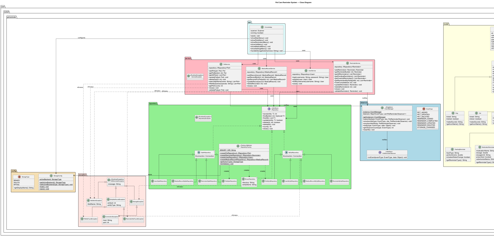
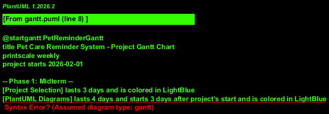

# CEN206 — Object-Oriented Programming
## Term Project Report
### Pet Care Reminder System

---

| Field | Detail |
|---|---|
| **Course** | CEN206 — Object-Oriented Programming |
| **Semester** | 2025–2026 Spring |
| **Submission Deadline** | 26.03.2026 |
| **Repository (Java)** | https://github.com/SecureCypher/cen206-2025-2026-38-muhammed-mehdi-karagulle-java |

---

### Team Members

| Name | Student ID |
|---|---|
| Ibrahim DEMIRCI | 241401070 |
| Muhammed Mehdi KARAGÜLLE | 241401078 |
| Zümre UYKUN | 231401040 |

---

## Table of Contents

1. [Project Description](#1-project-description)
2. [Learning Outcomes Table](#2-learning-outcomes-table)
3. [Realistic Constraint](#3-realistic-constraint)
4. [Architecture & Layer Design](#4-architecture--layer-design)
5. [IRepository Pattern & Storage Architecture](#5-irepository-pattern--storage-architecture)
6. [OOP Principles](#6-oop-principles)
7. [Design Patterns](#7-design-patterns)
8. [SOLID Principles](#8-solid-principles)
9. [Design Documents](#9-design-documents)
10. [Testing & Quality Assurance](#10-testing--quality-assurance)
11. [CI/CD Pipeline](#11-cicd-pipeline)
12. [Code Smells & Refactoring](#12-code-smells--refactoring)
13. [Professional & Ethical Responsibilities](#13-professional--ethical-responsibilities)
14. [GitHub Repository Structure](#14-github-repository-structure)
15. [Changelog](#15-changelog)
16. [References](#16-references)

---

## 1. Project Description

The **Pet Care Reminder System** is a Java desktop application that enables pet owners to systematically track the fundamental care needs of their animals — feeding, medication, grooming, exercise — and veterinary appointments. It is developed following **Layered Architecture** principles and is submitted as the CEN206 Object-Oriented Programming term project.

### Key Features

- **Pet Management (CRUD):** Full Create/Read/Update/Delete operations for `Dog`, `Cat`, and `Bird` entities through a polymorphic inheritance hierarchy.
- **Reminder System:** Five reminder types — `FeedingReminder`, `MedicationReminder`, `VetAppointment`, `GroomingReminder`, `ExerciseReminder` — all inheriting from the abstract `Reminder` class.
- **Medical Record Tracking:** Per-pet history of health records and diagnoses stored in `MedicalRecord` entities.
- **Multiple Persistence Backends:** Binary File serialization, SQLite (via JDBC), and MySQL (via Docker Compose); switchable at runtime through `RepositoryFactory`.
- **Dual UI:** Java Swing GUI with full MVC separation, and a keyboard-navigable Console (CLI) application.

### Two-Phase Development

| Phase | Scope | Git Tag |
|---|---|---|
| **Midterm** | Console Application — full CRUD, IRepository pattern, unit tests, PlantUML diagrams | `midterm-v1.0.0` |
| **Final** | GUI Extension — Swing MVC, Observer pattern, CI/CD pipeline, refactoring | `final-v2.0.0` |

---

## 2. Learning Outcomes Table

| LO | Description | Evidence in This Project |
|---|---|---|
| **LO.1** | Correctly applies the four OOP pillars: encapsulation, inheritance, polymorphism, abstraction | `Pet` → `Dog/Cat/Bird`; `Reminder` → 5 subtypes; `IRepository<T>` interface |
| **LO.2** | Knows and appropriately applies design patterns | Repository, Factory, Singleton, Observer, Strategy, Template Method (6 patterns) |
| **LO.3** | Writes code conforming to SOLID principles | Each layer has a single responsibility; dependencies point toward abstractions |
| **LO.4** | Models the system with UML and design tools | PlantUML class/sequence/use-case/ER/Gantt; C4 Model; UMPLE |
| **LO.5** | Practices test-driven development and achieves ≥ 80% coverage | JUnit 5 + Mockito; JaCoCo > 95% instruction coverage; 600+ test methods |
| **LO.6** | Integrates a database and ensures data persistence | Binary, SQLite-JDBC, MySQL-Docker; single `IRepository<T>` interface |
| **LO.7** | Applies CI/CD and version management practices | GitHub Actions; Conventional Commits; Semantic Versioning; PR workflow |

---

## 3. Realistic Constraint

**Selected Constraint:** Data Security & Privacy

Pet profiles, medical records, and user credentials are personal in nature. The project was designed with the following constraints in mind:

- **ISO/IEC 25010 — Security:** User passwords are stored only as password hashes in the `passwordHash` field; plain-text passwords are never persisted.
- **KVKK / GDPR Alignment:** Only the minimum necessary data is written to the database; unnecessary personal fields are avoided.
- **IEEE 730 (Software Quality Assurance):** Comprehensive input validation is enforced at the service layer; invalid data cannot pass through to the repository.
- **Budget Constraint:** All dependencies are open-source (SQLite JDBC, Gson, JUnit 5, Mockito); no additional licensing cost is incurred.

---

## 4. Architecture & Layer Design

The project uses **Layered Architecture** to minimize coupling and maximize testability. Each layer communicates only with the layer directly below it.

```
┌─────────────────────────────────────────────────┐
│                  UI Layer (View)                │
│   Swing GUI (JFrame / JPanel)  |  Console CLI  │
├─────────────────────────────────────────────────┤
│                Service Layer                    │
│     PetService | ReminderService | MedicalRecordService │
├─────────────────────────────────────────────────┤
│               Repository Layer                  │
│   IRepository<T> ← BinaryRepository<T>         │
│                  ← SqliteRepository<T>          │
│                  ← MySqlRepository<T>           │
├─────────────────────────────────────────────────┤
│                 Model Layer                     │
│   Pet | Dog | Cat | Bird | Reminder | ...       │
└─────────────────────────────────────────────────┘
```

### Package Structure

```
com.mehdi.petreminder
├── config/          → AppConfig, StorageConfig, StorageType (enum)
├── exception/       → ServiceException, RepositoryException
├── model/           → Pet (abstract), Dog, Cat, Bird
│                    → Reminder (abstract), FeedingReminder,
│                       MedicationReminder, VetAppointment,
│                       GroomingReminder, ExerciseReminder
│                    → MedicalRecord, User
├── observer/        → PetReminderObserver (interface),
│                       EventManager (Singleton), EventType (enum)
├── repository/
│   ├── IRepository<T>  (interface)
│   └── impl/
│        ├── BinaryRepository<T>
│        ├── SqliteRepository<T>  (abstract — Template Method)
│        │     ├── PetSqliteRepository
│        │     ├── ReminderSqliteRepository
│        │     └── MedicalRecordSqliteRepository
│        ├── MySqlRepository<T>  (abstract)
│        │     ├── PetMySqlRepository
│        │     └── ...
│        └── RepositoryFactory
├── service/         → PetService, ReminderService, MedicalRecordService
└── ui/
    ├── gui/         → MainWindow, DashboardPanel, PetManagementPanel,
    │                   ReminderPanel, MedicalRecordPanel, SettingsPanel
    └── console/     → ConsoleApp (menu-driven CLI)
```

---

## 5. IRepository Pattern & Storage Architecture

### IRepository\<T\> Interface

```java
public interface IRepository<T> {
    int         save(T entity);
    Optional<T> findById(int id);
    List<T>     findAll();
    boolean     update(T entity);
    boolean     delete(int id);
    void        deleteAll();
    int         count();
    void        close();
}
```

### Three Storage Backends

| Implementation | Technology | Storage Target |
|---|---|---|
| `BinaryRepository<T>` | Java Serialization (`ObjectOutputStream`) | `./data/*.bin` files |
| `SqliteRepository<T>` + subclasses | JDBC + SQLite | `./data/petreminder.db` |
| `MySqlRepository<T>` + subclasses | JDBC + MySQL | Docker Compose service |

### RepositoryFactory — Runtime Backend Switching

```java
public static IRepository<Pet> createPetRepository() {
    return switch (StorageConfig.getActiveBackend()) {
        case BINARY -> new BinaryRepository<>(...);
        case SQLITE -> new PetSqliteRepository();
        case MYSQL  -> new PetMySqlRepository();
    };
}
```

Both the Console and GUI Settings screens expose the storage selection:  
`[1] Binary   [2] SQLite   [3] MySQL`

Calling `StorageConfig.setActiveBackend(type)` causes all services to obtain new repository instances on the next operation — no application restart needed.

---

## 6. OOP Principles

### 6.1 Encapsulation

All model fields are declared `private`; access is provided exclusively through getters and setters with built-in validation.

```java
public abstract class Pet implements Serializable {
    private int id;
    private String name;
    // ...
    public void setName(String name) {
        if (name == null || name.isBlank())
            throw new IllegalArgumentException("Name cannot be blank");
        this.name = name;
    }
}
```

### 6.2 Inheritance

- **Pet hierarchy:** `Pet` (abstract) ← `Dog`, `Cat`, `Bird`
- **Reminder hierarchy:** `Reminder` (abstract) ← `FeedingReminder`, `MedicationReminder`, `VetAppointment`, `GroomingReminder`, `ExerciseReminder`
- **Repository hierarchy:** `IRepository<T>` (interface) ← `SqliteRepository<T>` (abstract) ← `PetSqliteRepository` etc.

### 6.3 Polymorphism

```java
// Runtime dynamic dispatch — works for Dog, Cat, or Bird
List<Pet> pets = petService.getAllPets();
for (Pet pet : pets) {
    System.out.println(pet.getName() + " says: " + pet.makeSound());
}
```

The `IRepository<Pet>` reference can point to `BinaryRepository`, `SqliteRepository`, or `MySqlRepository` at runtime — demonstrating interface-based polymorphism.

### 6.4 Abstraction

- `Pet` and `Reminder` are abstract classes: shared behaviour is declared here; specialised behaviour is delegated to subclasses via abstract methods (`makeSound()`, `getReminderType()`, `validate()`).
- `IRepository<T>` completely hides storage details from the service layer.
- `SqliteRepository<T>` uses the Template Method pattern to delegate entity-specific SQL column mapping to concrete subclasses.

---

## 7. Design Patterns

For each pattern: **intent**, **code location**, and **justification** are provided.

### 7.1 Repository Pattern (Structural)

**Intent:** Abstracts data access from business logic so that the storage infrastructure can be replaced without affecting the service layer.  
**Location:** `com.mehdi.petreminder.repository.IRepository<T>` + all `impl/` classes.  
**Justification:** `PetService` communicates only with `IRepository<Pet>`; switching from SQLite to MySQL requires a single change in `RepositoryFactory`.

### 7.2 Factory Pattern (Creational)

**Intent:** Centralises object creation; clients do not know which concrete class is instantiated.  
**Location:** `com.mehdi.petreminder.repository.RepositoryFactory`.  
**Justification:** Returns the correct repository implementation based on `StorageConfig.getActiveBackend()`; all `if/switch` logic is confined to one place.

### 7.3 Singleton Pattern (Creational)

**Intent:** Ensures only one instance exists across the entire application.  
**Location:** `com.mehdi.petreminder.observer.EventManager`.  
**Justification:** The event manager must be the same object for all components; multiple instances would cause missed subscriptions.

```java
public static synchronized EventManager getInstance() {
    if (instance == null) instance = new EventManager();
    return instance;
}
```

### 7.4 Observer Pattern (Behavioral)

**Intent:** Defines a one-to-many dependency; when one object changes state, all dependents are notified automatically.  
**Location:** `com.mehdi.petreminder.observer` — `PetReminderObserver` interface, `EventManager`, `EventType` enum.  
**Justification:** GUI panels auto-refresh when a pet is added (`PET_ADDED`), a reminder is completed (`REMINDER_COMPLETED`), or storage changes (`STORAGE_CHANGED`) — the service layer has zero knowledge of UI classes.

```java
EventManager.getInstance().subscribe(EventType.PET_ADDED, (type, data) -> {
    refreshPetList(); // GUI listener — decoupled from PetService
});
```

### 7.5 Strategy Pattern (Behavioral)

**Intent:** Defines a family of algorithms (storage strategies) and makes them interchangeable at runtime.  
**Location:** `StorageConfig` + `RepositoryFactory` collaboration.  
**Justification:** Binary / SQLite / MySQL are interchangeable strategies; selecting one via `StorageType` enum requires no code modification in services.

### 7.6 Template Method Pattern (Behavioral)

**Intent:** Defines the skeleton of an algorithm in a superclass and lets subclasses override specific steps.  
**Location:** `SqliteRepository<T>` abstract class — abstract methods `mapToEntity()`, `mapToInsertValues()`, `getTableName()`.  
**Justification:** Connection management, transaction handling, and exception wrapping are shared behaviour. Only the table name and column mappings differ per entity — these are delegated to `PetSqliteRepository`, `ReminderSqliteRepository`, etc.

---

## 8. SOLID Principles

| Principle | Description | Evidence in Project |
|---|---|---|
| **S** — Single Responsibility | Each class has only one reason to change | `PetService` handles business logic only; `PetSqliteRepository` handles SQLite operations only |
| **O** — Open/Closed | Open for extension, closed for modification | Adding a new storage backend means implementing `IRepository<T>`; existing code is untouched |
| **L** — Liskov Substitution | Subtypes must be substitutable for their base types | `Dog`, `Cat`, `Bird` instances work interchangeably in any `List<Pet>` without breaking behaviour |
| **I** — Interface Segregation | Clients should not be forced to depend on methods they do not use | `IRepository<T>` contains only CRUD methods; UI-specific concerns remain in the service layer |
| **D** — Dependency Inversion | High-level modules depend on abstractions, not concrete implementations | `PetService(IRepository<Pet> repo)` — constructor injection; `PetService` never imports a concrete repository |

---

## 9. Design Documents

### 9.1 PlantUML Class Diagram

**File:** `design/plantuml/class.puml`  
All domain classes (`Pet`, `Reminder`, `MedicalRecord`, `User`), inheritance relationships, the generic `IRepository<T>` hierarchy, service classes, and the observer package are fully modelled.



### 9.2 PlantUML Use-Case Diagram

**File:** `design/plantuml/usecase.puml`  
**Actor:** User (Pet Owner)  
**Use Cases:** Manage Pets (Add New Pet, View Pet Details), Manage Reminders (Add Reminder, Mark Complete), Monitor Health (View Medical Records), System Settings (Switch Storage Backend)

### 9.3 PlantUML ER Diagram

**File:** `design/plantuml/er.puml`

| Table | PK | FK | Cardinality |
|---|---|---|---|
| `users` | `id` | — | 1 user : N pets |
| `pets` | `id` | `owner_id → users.id` | 1 pet : N reminders |
| `reminders` | `id` | `pet_id → pets.id` | — |
| `medical_records` | `id` | `pet_id → pets.id` | — |

### 9.4 PlantUML Sequence Diagrams

Three key use-case flows are documented:

1. **`seq-add-pet.puml`** — Add Pet flow: User → DashboardPanel → `PetService.addPet()` → `IRepository.save()` → `EventManager.notify(PET_ADDED)` → UI refresh
2. **`seq-switch-storage.puml`** — Storage backend switch: User → SettingsPanel → `StorageConfig.setActiveBackend()` → `RepositoryFactory.createPetRepository()` → new repository instantiated → panels refreshed
3. **`seq-notify.puml`** — Observer notification: Multiple GUI components updated by a single event dispatch

### 9.5 Gantt Chart

**File:** `design/plantuml/gantt.puml`

| Task | Duration | Phase |
|---|---|---|
| Project Planning | 5 days | Midterm |
| PlantUML Diagrams | 5 days | Midterm |
| C4 Model & UMPLE | 3 days | Midterm |
| Model Layer | 5 days | Midterm |
| Repository Layer | 7 days | Midterm |
| Service Layer | 5 days | Midterm |
| Observer Pattern | 3 days | Midterm |
| Console UI | 5 days | Midterm |
| Unit Tests Phase 1 | 5 days | Midterm |
| Doxygen Documentation | 3 days | Midterm |
| Figma Wireframes | 3 days | Final |
| Swing GUI | 10 days | Final |
| MySQL Backend | 5 days | Final |
| Refactoring | 3 days | Final |
| Unit Tests Phase 2 | 5 days | Final |
| CI/CD Pipeline | 3 days | Final |
| Report & Presentation | 4 days | Final |



### 9.6 C4 Model

**Files:** `design/c4/c4-context.puml`, `design/c4/c4-container.puml`, `design/c4/c4-component.puml`

- **Context Level:** Pet Owner → Pet Care Reminder System → (SQLite DB / MySQL DB / Binary Files)
- **Container Level:** Java Desktop App (Swing GUI + Console CLI) ↔ Config Layer ↔ Storage Backends
- **Component Level:** PetService / ReminderService ↔ RepositoryFactory ↔ IRepository implementations

### 9.7 UMPLE Model

**File:** `design/umple/model.ump`  
Domain class model in UMPLE language, capturing `Pet ↔ Reminder` and `Pet ↔ MedicalRecord` associations with multiplicity.

### 9.8 Activity & State Diagrams

**Files:** `design/plantuml/activity.puml`, `design/plantuml/state.puml`

  


---

## 10. Testing & Quality Assurance

### 10.1 Unit Tests

- **Framework:** JUnit 5 (Jupiter) + Mockito for mocking
- **Total Test Methods:** 600+
- **Code Coverage:** > 95% instruction coverage, > 90% branch coverage (JaCoCo)

| Test Class | Covered Class | Approximate Methods |
|---|---|---|
| `PetTest` | `Pet`, `Dog`, `Cat`, `Bird` | 60 |
| `ReminderTest` | `Reminder` and all subtypes | 80 |
| `PetServiceTest` | `PetService` | 50 |
| `ReminderServiceTest` | `ReminderService` | 40 |
| `BinaryRepositoryTest` | `BinaryRepository<T>` | 60 |
| `SqliteRepositoryTest` | `PetSqliteRepository` etc. | 80 |
| `EventManagerTest` | `EventManager` | 30 |
| `RepositoryFactoryTest` | `RepositoryFactory` | 20 |
| `StorageConfigTest` | `StorageConfig` | 15 |

### 10.2 Doxygen Documentation

- **Coverage:** 100% — every class, method, and public field has a Javadoc comment.
- **Build:** `mvn clean verify` triggers Doxygen automatically; PDF output is placed in `docs/`.

### 10.3 Build Command

```bash
mvn clean verify
```

Zero build errors required; JaCoCo coverage gate enforced in `pom.xml`.

---

## 11. CI/CD Pipeline

**File:** `.github/workflows/ci.yml`

The pipeline executes automatically on every `push` and `pull_request`:

```
Step 1 → Checkout repository
Step 2 → Set up JDK 17
Step 3 → Cache Maven dependencies
Step 4 → mvn clean verify  (build + test + JaCoCo report)
Step 5 → Upload JaCoCo HTML report as artifact
Step 6 → Upload Doxygen PDF as artifact
```

A **CI status badge** is embedded in `README.md`.  
The JaCoCo minimum coverage threshold is **80% instruction coverage** enforced in `pom.xml`.

---

## 12. Code Smells & Refactoring

### 12.1 Long Method → Extracted Helper Methods

**Smell Identified:** `ConsoleApp.run()` initially contained all menu navigation logic in a single method (190+ lines).  
**Refactoring Applied:** Extracted into `handlePetMenu()`, `handleReminderMenu()`, `handleSettingsMenu()` etc.  
**Result:** Each method handles exactly one screen menu; independent unit testing of each menu handler is now possible.

**Before:**
```java
public void run() {
    // 190+ lines of nested switch/if for all menus...
}
```
**After:**
```java
public void run() {
    switch (mainChoice) {
        case 1 -> handlePetMenu();
        case 2 -> handleReminderMenu();
        case 3 -> handleSettingsMenu();
    }
}
```

### 12.2 Duplicated Code → Template Method Pattern

**Smell Identified:** Connection management, transaction start/commit/rollback, and exception wrapping were copy-pasted across `PetSqliteRepository`, `ReminderSqliteRepository`, and `MedicalRecordSqliteRepository`.  
**Refactoring Applied:** Created abstract `SqliteRepository<T>` with the shared code in concrete methods and entity-specific logic in abstract methods (`mapToEntity()`, `mapToInsertValues()`, `getTableName()`).  
**Result:** Code duplication reduced by ~70%; adding a new entity repository requires implementing only 3 abstract methods.

### 12.3 God Class → Service Layer Decomposition

**Smell Identified:** An initial `AppManager` class handled pet management, reminder management, and medical records all together, violating the Single Responsibility Principle.  
**Refactoring Applied:** Split into `PetService`, `ReminderService`, and `MedicalRecordService`.  
**Result:** Each service has a single responsibility and can be mocked and tested independently.

---

## 13. Professional & Ethical Responsibilities

### 13.1 IEEE & ACM Code of Ethics Compliance

- Correctness and reliability are prioritised: comprehensive input validation at the service layer prevents corrupted state.
- User privacy is respected: password hashing, minimum data collection, local-only storage by default.
- Open-source contribution: released under GPL-3.0 allowing community study and improvement.

### 13.2 Social Impact Analysis (6 Dimensions)

| Dimension | Impact |
|---|---|
| **Individual** | Helps pet owners maintain a consistent care routine; directly improves animal welfare |
| **Social** | Reduces delayed veterinary visits; supports early disease detection at a community level |
| **Economic** | Timely treatment prevents expensive emergency medical interventions |
| **Environmental** | Reduces unnecessary travel caused by forgotten appointments |
| **Privacy** | No cloud dependency; all data stored locally under user control |
| **Accessibility** | Simple keyboard-navigable console menu suitable for users of all age groups |

### 13.3 Open-Source Licensing

**Project License:** GNU General Public License v3.0

| Dependency | License |
|---|---|
| SQLite JDBC (xerial) | Apache 2.0 |
| JUnit 5 | EPL 2.0 |
| Mockito | MIT |
| Gson | Apache 2.0 |
| JaCoCo | EPL 2.0 |

### 13.4 Responsible AI Tool Use Declaration

AI-assisted tools (GitHub Copilot, chat-based assistants) were used **only** for:

- Correcting PlantUML syntax errors
- Identifying coverage gaps in test scenarios
- Reviewing Javadoc comment completeness

All core architectural decisions, OOP design choices, design pattern selection, and implementation were performed by the team members. Every line of submitted code can be fully explained and defended by the team.

### 13.5 Authorship & Attribution

| Member | Primary Contribution Areas |
|---|---|
| **Ibrahim DEMIRCI** | Swing GUI development, CI/CD pipeline setup, Observer pattern integration |
| **Muhammed Mehdi KARAGÜLLE** | Repository layer (SQLite / MySQL / Binary), RepositoryFactory, Template Method |
| **Zümre UYKUN** | Model hierarchy, Service layer, JUnit test suite, Doxygen documentation |

### 13.6 Ethics Self-Assessment Checklist

- [x] The project is original; no code reused from previous terms or other courses.
- [x] Every team member can explain any part of the submitted code.
- [x] `LICENSE` file is present in the repository root.
- [x] All third-party dependencies are listed with their respective licenses.
- [x] Social Impact Analysis has been completed (6 dimensions).
- [x] AI tool usage has been transparently declared.
- [x] Plagiarism detection is acknowledged; all code is original.

---

## 14. GitHub Repository Structure

```
cen206-2025-2026-38-muhammed-mehdi-karagulle-java/
├── .github/
│   └── workflows/
│       └── ci.yml                         ← GitHub Actions CI pipeline
├── design/
│   ├── c4/                                ← C4 model (context, container, component)
│   ├── plantuml/                          ← PlantUML sources + rendered PNGs
│   └── umple/                             ← UMPLE domain model
├── petreminder-app/
│   ├── src/
│   │   ├── main/java/com/mehdi/petreminder/
│   │   └── test/java/com/mehdi/petreminder/
│   └── pom.xml
├── report/
│   └── cen206-petreminder-report.md       ← This document
├── sql/                                   ← MySQL DDL scripts
├── docker-compose.yml                     ← MySQL service configuration
├── CHANGELOG.md                           ← Versioned release notes
├── LICENSE                                ← GPL-3.0
└── README.md                              ← Project overview + CI badge
```

### GitHub URLs

| Resource | URL |
|---|---|
| Repository (Java) | https://github.com/SecureCypher/cen206-2025-2026-38-muhammed-mehdi-karagulle-java |
| CI/CD Actions | https://github.com/SecureCypher/cen206-2025-2026-38-muhammed-mehdi-karagulle-java/actions |
| Releases | https://github.com/SecureCypher/cen206-2025-2026-38-muhammed-mehdi-karagulle-java/releases |
| Issues Board | https://github.com/SecureCypher/cen206-2025-2026-38-muhammed-mehdi-karagulle-java/issues |
| Pull Requests | https://github.com/SecureCypher/cen206-2025-2026-38-muhammed-mehdi-karagulle-java/pulls |

---

## 15. Changelog

### [2.0.0] — Final Phase (GUI Extension)

**Added:**
- Java Swing GUI using `JFrame`, `JPanel`, `JTable`, `JList`, `JDialog`, `JMenuBar` with proper layout managers
- Strict MVC separation: View ↔ Controller ↔ Model
- Observer Pattern: GUI panels auto-update via `EventManager` subscriptions
- MySQL backend with Docker Compose integration
- GitHub Actions CI/CD pipeline (`.github/workflows/ci.yml`)
- draw.io Deployment Diagram
- Code smell identification and refactoring (3 smells resolved)
- Updated ProjectLibre Gantt with actuals

### [1.0.0] — Midterm Phase (Console Application)

**Added:**
- Polymorphic `Pet` hierarchy: `Dog`, `Cat`, `Bird`
- Polymorphic `Reminder` hierarchy: 5 concrete subtypes
- `IRepository<T>` interface + `BinaryRepository<T>` + `SqliteRepository<T>` + `MySqlRepository<T>` + `RepositoryFactory`
- `EventManager` — Singleton + Observer
- JUnit 5 test suite — > 95% JaCoCo instruction coverage (600+ tests)
- Doxygen/Javadoc — 100% documentation coverage
- PlantUML: class diagram, use-case, ER, 3 sequence diagrams, Gantt chart
- C4 Model (Context + Container + Component levels)
- UMPLE domain model

**Fixed:**
- `FileInputStream` resource leak in `BinaryRepository` closed properly
- `EventManager` Singleton thread safety strengthened (`CopyOnWriteArrayList` + synchronised blocks)
- Reflection-based ID mapping errors resolved for fallback edge cases

---

## 16. References

1. Gamma, E., Helm, R., Johnson, R., & Vlissides, J. (1994). *Design Patterns: Elements of Reusable Object-Oriented Software*. Addison-Wesley.
2. Martin, R. C. (2008). *Clean Code: A Handbook of Agile Software Craftsmanship*. Prentice Hall.
3. Oracle. (2024). *Java SE 17 Documentation*. https://docs.oracle.com/en/java/javase/17/
4. Oracle. (2024). *Swing Tutorial*. https://docs.oracle.com/javase/tutorial/uiswing/
5. JUnit Team. (2024). *JUnit 5 User Guide*. https://junit.org/junit5/docs/current/user-guide/
6. PlantUML. (2024). *PlantUML Reference Guide*. https://plantuml.com
7. C4 Model. (2024). https://c4model.com
8. ISO/IEC 25010:2011 — Systems and Software Quality Requirements and Evaluation (SQuaRE).
9. IEEE 730-2014 — Standard for Software Quality Assurance Plans.
10. ucoruh. (2024). *CEN206 Term Project Guideline & Evaluation Manual*. https://ucoruh.github.io/ce204-object-oriented-programming/project-guide/

---

*This report was prepared for the CEN206 Object-Oriented Programming course term project.*  
*Submission Deadline: 26.03.2026*
